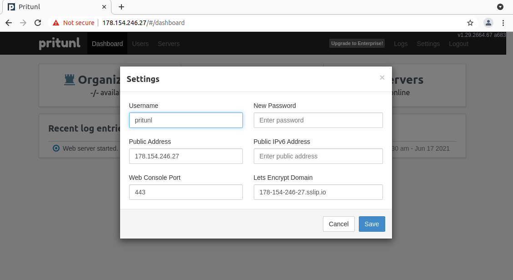

# Lesson 5 (cloud bostion)


## Задание

1. Подключение через бастион хост
2. Подключение к `someinternalhost` в одну команду
3. Дополнительное задание: подключение из консоли при помощи команды 
вида `ssh someinternalhost` из локальной консоли рабочего устройства

4. VPN-сервер для серверов Yandex.Cloud
5. Дополнительное задание: валидный сертификат для панели управления VPNсервера

<details>
  <summary>## Решение</summary>

### Подключение через бастион хост

```
bastion_IP = 178.154.255.64
someinternalhost_IP = 10.128.0.23
```


### Подключение к `someinternalhost` в одну команду

```
ssh -At appuser@bostion.ip ssh appuser@someinternalhost.ip

ssh -i ~/.ssh/appuser -A -J appuser@bostion.ip appuser@someinternalhost.ip

ssh -A -J appuser@bostion.ip appuser@someinternalhost.ip
```

### 3. Дополнительное задание: подключение из консоли при помощи команды вида `ssh someinternalhost` из локальной консоли рабочего устройства

Для подключения командой `ssh someinternalhost` создаем файл `~/.ssh/config` с содержанием:

```
host someinternalhost
HostName bostion.ip
Port 22
User appuser
Identityfile ~/.ssh/appuser
RequestTTY force
RemoteCommand ssh someinternalhost.ip
ForwardAgent yes
```

### 4. VPN-сервер для серверов Yandex.Cloud

С официального сайта забираем файл установки pritunl:

```
sudo tee /etc/apt/sources.list.d/mongodb-org-4.4.list << EOF
deb https://repo.mongodb.org/apt/ubuntu focal/mongodb-org/4.4 multiverse
EOF

sudo tee /etc/apt/sources.list.d/pritunl.list << EOF
deb https://repo.pritunl.com/stable/apt focal main
EOF

sudo apt-get --assume-yes install gnupg
wget -qO - https://www.mongodb.org/static/pgp/server-4.4.asc | sudo apt-key add -
sudo apt-key adv --keyserver hkp://keyserver.ubuntu.com --recv 7568D9BB55FF9E5287D586017AE645C0CF8E292A
sudo apt-get update
sudo apt-get --assume-yes install pritunl mongodb-org
sudo systemctl start pritunl mongod
sudo systemctl enable pritunl mongod
```

Устанавливаем:

```
sudo bash setupvpn.sh
```

Следуем инструкциям установщика по адресу:
```
https://<адрес bastion VM>/setup
```

После настройки создаем пользователя `test` с PIN `6214157507237678334670591556762`, добавлем сервер и организацию и включаем в организацию пользователя и сервер.

Файл настройки клиента VPN (пользователь = test) - [cloud-bostion.ovpn](cloud-bostion.ovpn)

### 5. Дополнительное задание: валидный сертификат для панели управления VPNсервера

Домен для bostion - 178-154-255-64.sslip.io

Доступ к printunl - https://178-154-255-64.sslip.io




</details>