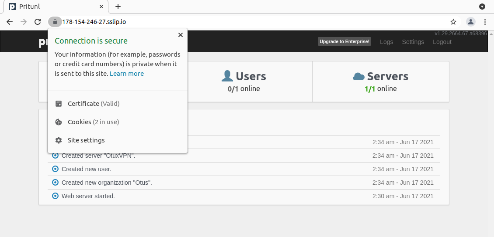

# Lesson 5 (cloud bostion)


## Задание

1. Подключение через бастион хост
2. Подключение к `someinternalhost` в одну команду
3. Дополнительное задание: подключение из консоли при помощи команды 
вида `ssh someinternalhost` из локальной консоли рабочего устройства

4. VPN-сервер для серверов Yandex.Cloud
5. Дополнительное задание: валидный сертификат для панели управления VPNсервера

## Решение
<details>
  <summary>Решение</summary>

### Подключение через бастион хост

```
bastion_IP = 178.154.246.27
someinternalhost_IP = 10.128.0.24
```


### Подключение к `someinternalhost` в одну команду

```
ssh -At appuser@bostion.ip ssh appuser@someinternalhost.ip

ssh -i ~/.ssh/appuser -A -J appuser@bostion.ip appuser@someinternalhost.ip

ssh -A -J appuser@bostion.ip appuser@someinternalhost.ip
```

### 3. Дополнительное задание: подключение из консоли при помощи команды вида `ssh someinternalhost` из локальной консоли рабочего устройства

Для подключения командой `ssh someinternalhost` создаем файл `~/.ssh/config` с содержанием:

```
host someinternalhost
HostName bostion.ip
Port 22
User appuser
Identityfile ~/.ssh/appuser
RequestTTY force
RemoteCommand ssh someinternalhost.ip
ForwardAgent yes
```

### 4. VPN-сервер для серверов Yandex.Cloud

С официального сайта забираем файл установки pritunl:

```
sudo tee /etc/apt/sources.list.d/mongodb-org-4.4.list << EOF
deb https://repo.mongodb.org/apt/ubuntu focal/mongodb-org/4.4 multiverse
EOF

sudo tee /etc/apt/sources.list.d/pritunl.list << EOF
deb https://repo.pritunl.com/stable/apt focal main
EOF

sudo apt-get --assume-yes install gnupg
wget -qO - https://www.mongodb.org/static/pgp/server-4.4.asc | sudo apt-key add -
sudo apt-key adv --keyserver hkp://keyserver.ubuntu.com --recv 7568D9BB55FF9E5287D586017AE645C0CF8E292A
sudo apt-get update
sudo apt-get --assume-yes install pritunl mongodb-org
sudo systemctl start pritunl mongod
sudo systemctl enable pritunl mongod
```

Устанавливаем:

```
sudo bash setupvpn.sh
```

Следуем инструкциям установщика по адресу:
```
https://<адрес bastion VM>/setup
```

После настройки создаем пользователя `test` с PIN `6214157507237678334670591556762`, добавлем сервер и организацию и включаем в организацию пользователя и сервер.

Файл настройки клиента VPN (пользователь = test) - [cloud-bostion.ovpn](cloud-bostion.ovpn)

### 5. Дополнительное задание: валидный сертификат для панели управления VPNсервера

Домен для bostion - 178-154-246-27.sslip.io

Доступ к printunl - https://178-154-246-27.sslip.io




</details>


# Lesson 6 (YC App Deploy)

## Задание

1. Установим и настроим yc CLI для работы с нашим аккаунтом;
2. Создадим хост с помощью CLI;
3. Установим на нем ruby для работы приложения;
4. Установим MongoDB и запустим;
5. Задеплоим тестовое приложение, запустим и проверим его работу.

6. Дополнительное задание: созданиe startup script, который будет запускаться при создании инстанса.

## Решение
<details>
  <summary>Решение</summary>

### 1. Установим и настроим yc CLI для работы с нашим аккаунтом

Установим:
```
curl https://storage.yandexcloud.net/yandexcloud-yc/install.sh | bash
```

Проиницилизируем и создадим профиль (по-умолчанию):

```
yc init
```

Вводим имя нашего  аккаунта на Яндекс Облако, получаем токен, далее создаем профиль, выбираем каталог созданный в профиле "облака" и зону размещения.

Прверим наш профиль:
```
yc config profile get <имя профиля>
```
Имя профиля = default


Некоторые команды для управления инстансами в YC:

```
yc compute instance list

yc compute instance start/stop <INSTANCE-NAME>

yc compute instance delete <INSTANCE-NAME>

yc compute instance get --full <INSTANCE-NAME>
```

### 2. Создадим хост с помощью CLI

```
yc compute instance create \
  --name reddit-app \
  --hostname reddit-app \
  --memory=4 \
  --create-boot-disk image-folder-id=standard-images,image-family=ubuntu-1604-lts,size=10GB \
  --network-interface subnet-name=default-ru-central1-a,nat-ip-version=ipv4 \
  --metadata serial-port-enable=1 \
  --ssh-key ~/.ssh/appuser.pub
```

Необходимые данные
```
testapp_IP = 178.154.203.173
testapp_port = 9292
```

### Задачи с 3 по 5 пункты

 - [install_ruby.sh](install_ruby.sh)
 - [install_mongodb.sh](install_mongodb.sh)
 - [deploy.sh](deploy.sh)


Сделаем скрипты исполняемыми:

```
chmod +x *.sh
```

### 6. Дополнительное задание: созданиe startup script, который будет запускаться при создании инстанса

Объеденим скрипты в единый и оптимизируем исполнение:


[startup-script.sh](startup-script.sh)
```
#!/bin/bash

wget -qO - https://www.mongodb.org/static/pgp/server-4.2.asc | sudo apt-key add -
echo "deb [ arch=amd64,arm64 ] https://repo.mongodb.org/apt/ubuntu xenial/mongodb-org/4.2 multiverse" | sudo tee /etc/apt/sources.list.d/mongodb-org-4.2.list

sudo apt-get update
sudo apt-get install -y ruby-full ruby-bundler build-essential mongodb-org git

sudo systemctl enable --now mongod

git clone -b monolith https://github.com/express42/reddit.git
cd reddit && bundle install
puma -d
```

Создадим файл с метаданными [metadata.yaml](metadata.yaml) и команду для создания инстанса:

```
yc compute instance create \
  --name reddit-app \
  --hostname reddit-app \
  --memory=4 \
  --create-boot-disk image-folder-id=standard-images,image-family=ubuntu-1604-lts,size=10GB \
  --network-interface subnet-name=default-ru-central1-a,nat-ip-version=ipv4 \
  --metadata serial-port-enable=1 \
  --metadata-from-file user-data=metadata.yaml
```

После создания инстанса автоматически будет выполнен заданный скрипт. 

</details> 


# Lesson 7 (YC Packer)

## Задание

1. Создание новой ветки
2. Установка Packer
3. Создание сервисного аккаунта на YC
4. Подготовка и сборка образа с помощью Packer

5. `*` Построение bake-образа
6. `*` Автоматизация создания ВМ

## Решение
<details>
  <summary>Решение</summary>

### 1. Создание новой ветки

Создаем новую ветку в репозитории и переносим в директорию config-scripts все скрипты из предыдущего задания:

```
git checkout -b packer-base

git mv *.sh config-scripts/ && git mv metadata.yaml config-scripts/
```

### 2. Установка Packer 

https://www.packer.io/downloads

```
curl -fsSL https://apt.releases.hashicorp.com/gpg | sudo apt-key add -
sudo apt-add-repository "deb [arch=amd64] https://apt.releases.hashicorp.com $(lsb_release -cs) main"
sudo apt-get update && sudo apt-get install packer
```

Проверим:

```
$  packer -v

1.7.3
```

### 3. Сервсиный аккаунт для Packer

Получим данные для нашего YC:

```
yc config list
```

Из параметров нужен `folder-id`. Создаем переменные для окружения (будем использовать в разных местах):

```
SVC_ACCT="packer-user"
FOLDER_ID="folder-id_from_config"
```

Создаем сервисный аккаунт:

```
yc iam service-account create --name $SVC_ACCT --folder-id $FOLDER_ID
```

Если посмотреть в YC => Каталог => Сервисные аккаунты, то увидим, что пользователь создан, но у него нет роли. Назначить роль можно через веб, но создадим через консоль:

```
ACCT_ID=$(yc iam service-account get $SVC_ACCT | grep ^id | awk '{print $2}')

yc resource-manager folder add-access-binding --id $FOLDER_ID --role editor --service-account-id $ACCT_ID
``` 

Если проверить через веб, можно убедиться, что `packer-user` уже имеет роль `editor`.

**Создаем service account key file**

Создаем и сохраняем за переделами репозитория IAM key:
```
yc iam key create --service-account-id $ACCT_ID --output ~/key.json
```

### 4. Подготовка и сборка образа с помощью Packer

**Создание файла-шаблона Packer**

Создаем директорию `packer` и внутри файл `ubuntu16.json`. Создаем builders и provisioners


```
{
    "builders": [
        {
            "type": "yandex",
            "service_account_key_file": "~/key.json",
            "folder_id": "b1gqsnnn5lhvmg8osug4",
            "source_image_family": "ubuntu-1604-lts",
            "image_name": "reddit-base-{{timestamp}}",
            "image_family": "reddit-base",
            "ssh_username": "ubuntu",
            "platform_id": "standard-v1"
        }
    ]
}

{
    "builders": [
        {
            "type": "yandex",
            "service_account_key_file": "~/key.json",
            "folder_id": "folder-id_from_config",
            "source_image_family": "ubuntu-1604-lts",
            "image_name": "reddit-base-{{timestamp}}",
            "image_family": "reddit-base",
            "ssh_username": "ubuntu",
            "platform_id": "standard-v1",
            "use_ipv4_nat": "true"
        }
    ],
    "provisioners": [
        {
            "type": "shell",
            "script": "scripts/install_ruby.sh",
            "execute_command": "sudo {{.Path}}"
        },
        {
            "type": "shell",
            "script": "scripts/install_mongodb.sh",
            "execute_command": "sudo {{.Path}}"
        }
    ]
}
```

Скопируем скрипты в указанные директории из `ubuntu16.json`.

Выполним проверку на синтаксис:

```
packer validate ./ubuntu16.json
```

**Вероятные ошибки:**

```
==> yandex: Error creating network: server-request-id = b8b864e7-e820-4279-9d77-c4bc141ec3ec server-trace-id = d4660b864ca49486:a91e4f7eb2529a2b:d4660b864ca49486:1 client-request-id = 407e35ae-ca89-43c0-8b47-d974ef6029a6 client-trace-id = ae43a2fb-40e8-43b2-9aaf-125ecb4a8f59 rpc error: code = ResourceExhausted desc = Quota limit vpc.networks.count exceeded
Build 'yandex' errored after 1 second 523 milliseconds: Error creating network: server-request-id = b8b864e7-e820-4279-9d77-c4bc141ec3ec server-trace-id = d4660b864ca49486:a91e4f7eb2529a2b:d4660b864ca49486:1 client-request-id = 407e35ae-ca89-43c0-8b47-d974ef6029a6 client-trace-id = ae43a2fb-40e8-43b2-9aaf-125ecb4a8f59 rpc error: code = ResourceExhausted desc = Quota limit vpc.networks.count exceeded
```

Удалим все созданные сети (подсети).

```
==> yandex: Provisioning with shell script: scripts/install_ruby.sh

...

==> yandex:
==> yandex: WARNING: apt does not have a stable CLI interface. Use with caution in scripts.
==> yandex:
==> yandex: E: Could not get lock /var/lib/dpkg/lock-frontend - open (11: Resource temporarily unavailable)
==> yandex: E: Unable to acquire the dpkg frontend lock (/var/lib/dpkg/lock-frontend), is another process using it?
```

Говорит о том, что apt чем-то занят и не может залочить для установки другого пакета. Посмотрим скрипт `install_ruby.sh`. Предположительно `apt update` не успел закочить процесс, а `apt install` уже пытается установить. Сделаем паузу между этими командами:

```
echo "Sleep 30 sec for apt update"; sleep 30s; echo "start apt install"

```

**Проверка образа**

Создаем ВМ на основе нашего образа и ставим reddit:

```
sudo apt-get update
sudo apt-get install -y git
git clone -b monolith https://github.com/express42/reddit.git
cd reddit && bundle install
puma -d
```

http://vm_ip_adress:9292 

**Параметризирование шаблона**

Создаем `variables.json`, `.gitignore` файлы и для коммита в репозиторий `variables.json.examples`. В gitignore включаем variables.json.

```
$ cat variables.json.examples

{
  "key": "key.json",
  "folder_id": "folder-id_from_config",
  "image": "ubuntu-1604-lts"
}
```

Вносим изменения в файл [ubuntu16.json](packer/ubuntu16.json).


Проверим и запустим сборку:

```
packer validate -var-file=./variables.json ./ubuntu16.json
packer build -var-file=./variables.json ./ubuntu16.json
```

### 5. Построение bake-образа `*`

На основе ubuntu16.json создадим immutable.json и заменим требуемые значения согласно инструкции.

Напишем [systemd unit](packer/files/puma.service) для запуска puma. Подготивим [immutable.json](packer/immutable.json).

Проверим и запустим сборку:

```
packer validate -var-file=./variables.json ./immutable.json
packer build -var-file=./variables.json ./immutable.json
```

Проверим наши имиджы и запомним id, он понадобится для скрипта `config-scripts/create-reddit-mv.sh`:

```
yc compute image list
```

После сборки создадим сеть и подсети, поскольку мы удалили из-за ошибки в сборке и ограничений в ЯО, можно через веб или:

```
yc vpc network create --name default
```

Не забываем создавать подсети:

```
 yc vpc subnet create --name test-subnet-1 \
  --description "My test subnet" \
  --folder-id b1g6ci08ma55klukmdjs \
  --network-id enplom7a98s1t0lhass8 \
  --zone ru-central1-b \
  --range 192.168.0.0/24
```
> https://cloud.yandex.ru/docs/vpc/operations/subnet-create


### 6. Автоматизация создания ВМ `*`

Cкрипт создания ВМ [create-reddit-vm.sh](config-scripts/create-reddit-vm.sh)

</details>  

# Lesson 8 (YC Terraform 1)

## Задание

1. Установка Terraform и создание инфраструктуры
2. Создание ВМ с помощью Terraform
3. Входные переменные Terraform

4. Балансировщик на 2 инстанса `*`

## Решение
<details>
  <summary>Решение</summary>

### 1. Установка Terraform 

Установим terraform требуемой версии (0.12.8):

```
wget https://releases.hashicorp.com/terraform/0.12.8/terraform_0.12.8_linux_amd64.zip
unzip terraform_0.12.8_linux_amd64.zip

sudo mv terraform /usr/local/bin; rm terraform_0.12.8_linux_amd64.zip
```
Проверим:

```
$ terraform -v

Terraform v0.12.8
```

Создаем директорию `terraform` и файл внутри файл `main.tf`. Редактируем файл `.gitignore`

```
...


*.tfstate
*.tfstate.*.backup
*.tfstate.backup
*.tfvars
.terraform/
```

Для работы Terraform создадим сервисный аккаунт `terraform`:

```
yc config list

FOLDER_ID="folder-id_from_config"

уc iam service-account create --name terraform --folder-id $FOLDER_ID

yc resource-manager folder add-access-binding --id $FOLDER_ID --role editor --service-account-id $(yc iam service-account get terraform | grep ^id | awk '{print $2}')

yc iam key create --service-account-id terraform_user_id --output ~/terraform.json
```

Редактируем файл `main.tf`:

```
provider "yandex" {
  version   = 0.35
  token     = "<OAuth или статический ключ сервисного аккаунта>"
  cloud_id  = "<идентификатор облака>"
  folder_id = "<идентификатор каталога>"
  zone      = "ru-central1-a"
}
```

параметры для файла:

```
yc config list
```

Проводим инициализацию, будет загружен провайдер указанный в mian.tf (yandex):

```
terraform init
```

### 2. Создание ВМ с помощью Terraform


Добавим требуемые условия (согласно инструкции) для создания новой ВМ в `main.tf` и даем комманды:

```
terraform plan

terraform apply
```

Подправим ошибку в конфигурации:

```
...
  resources {
    cores  = 2
    memory = 2
  }
...
```

добавим подключение по ssh, в `main.tf`:

```
metadata = {
  ssh-keys = "ubuntu:${file("~/.ssh/appuser.pub")}"
}
```

и еще раз `terraform apply`

```
$ terraform show | grep nat_ip_address
        nat_ip_address = "217.28.231.223"
$ shh ubuntu@217.28.231.223
```

Успешно подключились.

Создадим новый файл `outputs.tf` для вывода информации о создоваемый ВМ, чтоб каждый раз не использовать `terraform show`

```
output "external_ip_address_app" {
  value = yandex_compute_instance.app.network_interface.0.nat_ip_address
}
```

и проверим:

```
terraform refresh

terraform output
```

**Создаем Provisioner**

Добавляем в `main.tf` два provisioner-а:

```
provisioner "file" {
  source = "files/puma.service"
  destination = "/tmp/puma.service"
}
```
[files/puma.service](terraform/files/puma.service) это systemd unit файл и:

```
provisioner "remote-exec" {
  script = "files/deploy.sh"
}
```
[files/deploy.sh](terraform/files/deploy.sh) это скрипт установки приложения.


Парметры подключения провиженеров к ВМ:

```
connection {
    type = "ssh"
    host = yandex_compute_instance.app.network_interface.0.nat_ip_address
    user = "ubuntu"
    agent = false
    # путь до приватного ключа
    private_key = file("~/.ssh/yc")
    }

```

Применим наши изменения:

```
terraform taint yandex_compute_instance.app
terraform plan
terraform apply
```

После успешного выполенения получим:

```
Apply complete! Resources: 1 added, 0 changed, 1 destroyed.

Outputs:

external_ip_address_app = 217.28.231.189
```

Наш сервис доступен http://217.28.231.189:9292

### 3. Входные переменные Terraform

Определим наши входные переменные. Создадим файл [variables.tf](terraform/variables.tf) и определим параметры в `main.tf`:

```
provider "yandex" {
  service_account_key_file = var.service_account_key_file
  cloud_id  = var.cloud_id
  folder_id = var.folder_id
  zone      = var.zone
}
```

и 

```
  boot_disk {
    initialize_params {
      image_id = var.image_id
    }
  }

  network_interface {
    subnet_id = var.subnet_id
    nat       = true
  }

  metadata = {
  ssh-keys = "ubuntu:${file(var.public_key_path)}"
  }

```

Создаем файл `terraform.tfvars`, из которого загружаются значения автоматически при каждом запуске:

```
cloud_id = "b1g7mh55020i2hpup3cj"
folder_id = "b1g4871feed9nkfl3dnu"
zone = "ru-central1-a"
image_id = "fd8mmtvlncqsvkhto5s6"
public_key_path = "~/.ssh/appuser.pub"
subnet_id = "e9bem33uhju28r5i7pnu"
service_account_key_file = "key.json"
```

Пересоздадим все ресурсы созданные при помощи terraform:

```
terraform destroy

terraform plan
terraform apply
```


### 4. Балансировщик на 2 инстанса `*`

Создаем файл `lb.tf`, внитури блок целевой группы (target group):

```
resource "yandex_lb_target_group" "reddit_target_group" {
  name      = "reddit-lb-group"
  folder_id = var.folder_id
  region_id = var.region_id

  target {
    address = yandex_compute_instance.app.network_interface.0.ip_address
      subnet_id = var.subnet_id
  }
}
```

и создаем сам балансировщик соедененный с целевой группой:

```
resource "yandex_lb_network_load_balancer" "lb" {
  name = "reddit-lb"
  type = "external"

  listener {
    name        = "listener"
    port        = 80
    target_port = 9292

    external_address_spec {
      ip_version = "ipv4"
    }
  }

  attached_target_group {
    target_group_id = yandex_lb_target_group.reddit_target_group.id

    healthcheck {
      name = "tcp"
      tcp_options {
        port = 9292
      }
    }
  }
}
```

Для удобства балансировщик слушает порт 80 и передает на порт нашего приложения 9292.

Посмотреть балансировщики:

```
yc load-balancer target-group list

yc load-balancer network-load-balancer list
```

> https://cloud.yandex.ru/docs/network-load-balancer/operations/internal-lb-create
> https://registry.terraform.io/providers/yandex-cloud/yandex/0.44.0/docs/resources/lb_network_load_balancer
> https://registry.terraform.io/providers/yandex-cloud/yandex/0.44.0/docs/resources/lb_target_group


Добавим переменную на вывод external IP для балансировщика:

``` 
output "loadbalancer_ip_address" {
  value = yandex_lb_network_load_balancer.lb.listener.*.external_address_spec[0].*.address
}
```

Дадим команду на сборку:

```
terraform plan

terraform apply
```

Проверим, что наше приложение доступно по адресу балансировщика.

Добавим еще один инстанс **reddit-app2**:

в `main.tf`:
```
resource "yandex_compute_instance" "app2" {
  name  = "reddit-app2"

...
```

в `outputs.tf` заменим на:

```
output "external_ip_address_app" {
  value = yandex_compute_instance.app[*].network_interface.0.nat_ip_address
}
```

в `lb.tf` добавим еще один таргет:

```
target {
  address = yandex_compute_instance.app2.network_interface.0.ip_address
  subnet_id = var.subnet_id
}
```

> Возможная ошибка:

```
Error: error executing "/tmp/terraform_2015131243.sh": Process exited with status 100
```
Установим паузу на выполнение скрипта 30 сек.


**Создаем ВМ с помощью count**

Добавим переменную в `variables.tf` со занчением по умолчанию = 1: 

```
variable instance_count {
  description = "count instances"
  default     = 1
}
```

в `main.tf` удалим параметы для **reddit-app2** и добавим:

```
resource "yandex_compute_instance" "app" {
  name  = "reddit-app-${count.index}"
  count = var.instance_count

...

  connection {
    type  = "ssh"
    host  = self.network_interface.0.nat_ip_address
    user  = "ubuntu"
    agent = false
    # путь до приватного ключа
    private_key = file(var.private_key_path)
  }
```

в `lb.tf` заменим значения target на dynamic:

```
  dynamic "target" {
    for_each = yandex_compute_instance.app.*.network_interface.0.ip_address
    content {
      subnet_id = var.subnet_id
      address   = target.value
    }
  }
```

Теперь меняя значение переменно `instance_count` можно получать данное значение инстансов за балансировщиком.

> https://www.terraform.io/docs/language/expressions/dynamic-blocks.html
> https://www.hashicorp.com/blog/hashicorp-terraform-0-12-preview-for-and-for-each


```
terraform plan

terraform apply -auto-approve
```

Плюсы динамического расширения и балансировки:
* не надо писать много кода (вероятность опечатки и ошибки);
* легко масштабировать.

Минусы для данного решения:
* нет общей базы mongodb (при потере инстанса, теряем и его базу).

</details>


</details>  

# Lesson 9 (YC Terraform 2)

## Задание

1. Настройка окружения
2. Два образа Packer
3. Разбиваем main.tf на части
4. Модули
5. Переиспользование модулей 

6. Хранение стейт файла в удаленном бекенде ⭐
7. Добавить необходимые provisioner в модули ⭐⭐

## Решение
<details>
  <summary>Решение</summary>

### 1. Настройка окружения

Создаем ветку `terraform-2` и переносим файлы:

```
git checkout -b terraform-2

git mv terraform/lb.tf terraform/files/
```

Зададим IP для инстанса с приложением в виде внешнего ресурса, в `main.tf` добавим:

```
resource "yandex_vpc_network" "app-network" {
  name = "reddit-app-network"
}

resource "yandex_vpc_subnet" "app-subnet" {
  name           = "reddit-app-subnet"
  zone           = "ru-central1-a"
  network_id     = "${yandex_vpc_network.app-network.id}"
  v4_cidr_blocks = ["192.168.10.0/24"]
}
```

И добавим в настройки ссылку на созданный сетевой ресурс:

```
  network_interface {
    subnet_id = yandex_vpc_subnet.app-subnet.id
    nat = true
  }
```

Проверим как работают зависимости:

```
terraform destroy
terraform plan
terraform apply
```

Можно увидеть, что ресурсы создается не паралельно, а в зависимости одного от другого. 


### 2. Два образа Packer (app и db)

Создаем 2 файла на основе готового `ubuntu16.json` и разносим для Packer образы системы. Меням параметры для каждого образа и оставлем только его провижн:

```
"image_name": "reddit-app-base-{{timestamp}}",
"image_family": "reddit-app-base",

-----

image_name": "reddit-db-base-{{timestamp}}",
"image_family": "reddit-db-base",
```

Соберем образы:

```
packer validate -var-file=./variables.json ./db.json
packer build -var-file=./variables.json ./db.json

packer validate -var-file=./variables.json ./app.json
packer build -var-file=./variables.json ./app.json
```

### 3. Разбиваем main.tf на части

Разобьем конфиг main.tf на несколько конфигов и добавим новые переменные:

в variables.tf
```
variable app_disk_image {
  description = "Disk image for reddit app"
  default     = "reddit-app-base"
}
variable db_disk_image {
  description = "Disk image for mongodb"
  default     = "reddit-db-base"
```

в terraform.tfvars
```
app_disk_image = "reddit-app-base"
db_disk_image = "reddit-db-base"
```

Создаем файл `app.tf`:

```
resource "yandex_compute_instance" "app" {
  name = "reddit-app"

  labels = {
    tags = "reddit-app"
  }
  resources {
    cores  = 2
    memory = 2
  }

  boot_disk {
    initialize_params {
      image_id = var.app_disk_image
    }
  }

  network_interface {
    subnet_id = yandex_vpc_subnet.app-subnet.id
    nat = true
  }

  metadata = {
  ssh-keys = "ubuntu:${file(var.public_key_path)}"
  }
}
```
Создаем файл `db.tf`:

```
resource "yandex_compute_instance" "db" {
  name = "reddit-db"
  labels = {
    tags = "reddit-db"
  }

  resources {
    cores  = 2
    memory = 2
  }

  boot_disk {
    initialize_params {
      image_id = var.db_disk_image
    }
  }

  network_interface {
    subnet_id = yandex_vpc_subnet.app-subnet.id
    nat = true
  }

  metadata = {
  ssh-keys = "ubuntu:${file(var.public_key_path)}"
  }
}
```

Создаем файл `vpc.tf`:

```
resource "yandex_vpc_network" "app-network" {
  name = "app-network"
}

resource "yandex_vpc_subnet" "app-subnet" {
  name           = "app-subnet"
  zone           = "ru-central1-a"
  network_id     = "${yandex_vpc_network.app-network.id}"
  v4_cidr_blocks = ["192.168.10.0/24"]
}
```

`main.tf` приходит к виду:

```
provider "yandex" {
  version                  = 0.35
  service_account_key_file = var.service_account_key_file
  cloud_id                 = var.cloud_id
  folder_id                = var.folder_id
  zone                     = var.zone
}
```

правим `outputs.tf`:

```
output "external_ip_address_app" {
  value = yandex_compute_instance.app.network_interface.0.nat_ip_address
}
output "external_ip_address_db" {
  value = yandex_compute_instance.db.network_interface.0.nat_ip_address
}
```

Протестируем новую конфигурацию:

```
terraform plan
terraform apply
```

Для проверки убедимся, что имеет доступ по ssh к ВМ.

### 4. Модули

Создаем модульную инфраструктуру, в папке terraform cоздаем папку modules, внутри директории modules еще две директории: app и db и в каждой папке создаем структуру из main.tf, outputs.ft и variables.tf:

В main.tf перенесем данные из app.tf и db.tf соответсвенно. Определим переменные модулей и outputs. 

После из папки terraform удаляем уже ненужные файлы `app.tf`, `db.tf`, `vpc.tf` и правим `outputs.tf`:

```
output "external_ip_address_app" {
  value = module.app.external_ip_address_app
}
output "external_ip_address_db" {
  value = module.db.external_ip_address_db
}
```

Загружаем модули:

```
terraform get
```

Собираем окружение:
```
terraform plan
terraform apply
```

### 5. Переиспользование модулей

Создаем директории `prod` и `stage` в `terraform` и копируем файлы main.tf, variables.tf, outputs.tf,
terraform.tfvars, key.json из директории terraform в каждую из созданных директорий.

В stage и prod корректируем пути к модулям в main.tf:

```
module "app" {
  source          = "../modules/app"
  public_key_path = var.public_key_path
  app_disk_image  = var.app_disk_image
  subnet_id       = var.subnet_id
}

module "db" {
  source          = "../modules/db"
  public_key_path = var.public_key_path
  db_disk_image   = var.db_disk_image
  subnet_id       = var.subnet_id
}
```

Правим синтаксис:
```
terraform fmt
```

и проверяем на каждом стенде:

```
terraform init
terraform apply
```

Должны получить идентичные окружения.

### 6. Хранение стейт файла в удаленном бекенде ⭐

Создаем внешней бекенд:

```
provider "yandex" {
  token     = "<OAuth>"
  cloud_id  = "<идентификатор облака>"
  folder_id = "<идентификатор каталога>"
  zone      = "ru-central1-a"
}

resource "yandex_storage_bucket" "test" {
  access_key = "<идентификатор статического ключа>"
  secret_key = "<секретный ключ>"
  bucket = "<имя бакета>"
}
```

Нам необходимы данные access_key и secret_key. Сгенерируем для сервисного аккаунта terraform:

```
yc iam service-account list

yc iam access-key create --service-account-name terraform
```

где:

```
access_key = key_id

secret_key = secret
```

Полученные параметы добавим в переменные `variables.tf` и :

```
variable access_key {
  description = "key id"
}
variable secret_key {
  description = "secret key"
}
variable bucket_name {
  description = "bucket name"
}
```

> https://cloud.yandex.ru/docs/storage/operations/buckets/create
> https://registry.terraform.io/providers/yandex-cloud/yandex/latest/docs

Создаем бакет:

```
terraform plan
terraform apply
```

В средах prod и stage создаем `backend.tf`:

```
cat prod/backend.tf

terraform {
  backend "s3" {
    endpoint   = "storage.yandexcloud.net"
    bucket     = "otus-meno"
    region     = "ru-central1"
    key        = "prod/terraform.tfstate"
    access_key = "key_id"
    secret_key = "secret"


    skip_region_validation      = true
    skip_credentials_validation = true
   }
}
```
> К сожалению `backend "s3"` не хочет принимать переменные в формате `var.var_name`

После можно запускать проекты и `.tfstate` файлы будут храниться в бакете и одновремнно запускать создание инстансов не получится из-за блокировки со сторны s3.


### 7. Добавить необходимые provisioner в модули ⭐⭐

В первую очередь надо узнать каким образом наше приложение соеденяется с базой mongo-db и наш mongo-db должен слушать наш сетевой адрес на подключение.

Создадим два `.tmpl` файла: puma.service.tmpl - это шаблон для нашего systemd unit файла, mongod.conf.tmpl - конфиг нашего mongo-db.


```
cat puma.service.tmpl

[Unit]
Description=Puma HTTP Server
After=network.target

[Service]
Type=simple
User=ubuntu
Environment=DATABASE_URL=${mongod_ip}
WorkingDirectory=/home/ubuntu/reddit
ExecStart=/bin/bash -lc 'puma'
Restart=always

[Install]
WantedBy=multi-user.target
```
где DATABASE_URL=${mongod_ip} - адрес инстанса db.


```
cat mongodb.conf

....

# network interfaces
net:
  port: 27017
  bindIp: ${mongod_ip}
....  

```

данные шаблоны и скрипт deploy.sh разместим в директориях files для каждого инстанса и приведем к описанному виду:

```
mkdir modules/app/files
mkdir modules/db/files

cp files/deploy.sh modules/app/files; cp files/puma.service modules/app/files/puma.service.tmpl
```

Добавим провижионеры в `main.tf` app:

```
  connection {
    type        = "ssh"
    host        = yandex_compute_instance.app.network_interface[0].nat_ip_address
    user        = "ubuntu"
    agent       = false
    private_key = file(var.private_key_path)
  }
  provisioner "file" {
    content     = templatefile("${path.module}/files/puma.service.tmpl", { mongod_ip = var.mongod_ip})
    destination = "/tmp/puma.service"
  }

  provisioner "remote-exec" {
    script = "${path.module}/files/deploy.sh"
  }
```

Добавим провижионеры в `main.tf` db:

```
  connection {
    type        = "ssh"
    host        = yandex_compute_instance.db.network_interface[0].nat_ip_address
    user        = "ubuntu"
    agent       = false
    private_key = file(var.private_key_path)
  }
  provisioner "file" {
    content     = templatefile("${path.module}/files/mongod.conf.tmpl", { mongob_ip = yandex_compute_instance.db.network_interface.0.ip_address})
    destination = "/tmp/mongod.conf"
  }

  provisioner "remote-exec" {
    script = "${path.module}/files/deploy.sh"
  }

```

и создадим простой скрипт, который перенесет конфиг mongo-db и сделает рестарт:

```
cat db/files/deploy.sh

sudo mv -f /tmp/mongod.conf /etc/mongod.conf
sudo systemctl restart mongod
```

Добавим значение `mongod_ip` в db/outputs.ff:
```
output "internal_ip_address_db" {
  value = yandex_compute_instance.db.network_interface.0.ip_address
}
```

Модули настроили, теперь внесем изменения в `main.tf` наших сред (prod или stage):

```
module "app" {
  source           = "../modules/app"
  public_key_path  = var.public_key_path
  private_key_path = var.private_key_path
  app_disk_image   = var.app_disk_image
  subnet_id        = var.subnet_id
  mongod_ip        = module.db.internal_ip_address_db
}
```

> module.db.internal_ip_address_db - это значение output из модуля db -> outputs.tf

Проверим:

```
terraform plan
terraform apply
```

Результат - наше приложение задеплоилось автоматически и доступно по http://app_ip:9292


**Опционально. Реализовать отключение provisioner в зависимости от значения переменной**

Для решения данной задачи подойдет ресурс null_resource. 

*null_resource это обычные ресурсы, но ничего не делают.*
> https://www.terraform.io/docs/language/resources/provisioners/null_resource.html

В качестве переменной значения включено/выключено используем аргумент count в качестве условного выражения (Conditional Expressions).

> https://www.terraform.io/docs/language/meta-arguments/count.html
> https://www.terraform.io/docs/language/expressions/conditionals.html


Добавим в `main.tf` наших модулей app и db следующий код перед connection соответственно:

```
resource "null_resource" "app" {
  count = var.enable_provision ? 1 : 0
  triggers = {
    cluster_instance_ids = yandex_compute_instance.app.id
  }

```

```
resource "null_resource" "db" {
  count = var.enable_provision ? 1 : 0
  triggers = {
    cluster_instance_ids = yandex_compute_instance.db.id
  }
```

Добавим переменную в `variables.tf`:

```
variable enable_provision {
  description = "Enable provisioner"
  default = true
}
```

</details>

# Lesson 10 (Ansible 1)

## Знакомство с Ansible
1. Установка и настройка Ansible
2. YAML inventory
3. Простой плейбук

4. Динамический инвентори в формате json ⭐

## Решение
<details>
  <summary>Решение</summary>

### Установка Ansible

В официальной документации Ansible существует подбробная инструкция по установке на каждую поддерживаемую ОС. В моем случае это Ubuntu и установлен из apt репозитория:

```
ansible --version

ansible 2.10.5
```

что соответствует `requirements.txt`:

```
ansible>=2.4
```

Запустим инфраструктуру `stage` и на остнове outputs информации создадим ansible/inventory файл:

```
appserver ansible_host=178.154.204.210 ansible_user=appuser ansible_private_key_file=~/.ssh/appuser
```

и проверим:

```
ansible appserver -i ./inventory -m ping

appserver | SUCCESS => {
    "ansible_facts": {
        "discovered_interpreter_python": "/usr/bin/python3"
    },
    "changed": false,
    "ping": "pong"
```

добавим параметры для `dbserver` и повторим:

```
ansible all -i ./inventory -m ping

appserver | SUCCESS => {
    "ansible_facts": {
        "discovered_interpreter_python": "/usr/bin/python3"
    },
    "changed": false,
    "ping": "pong"
}
dbserver | SUCCESS => {
    "ansible_facts": {
        "discovered_interpreter_python": "/usr/bin/python3"
    },
    "changed": false,
    "ping": "pong"
}
```

Создаем `ansible.cfg` для переноса настроек из `inventory`, что упростит управление:

```
[defaults]
inventory = ./inventory
remote_user = appuser
private_key_file = ~/.ssh/appuser
host_key_checking = False
retry_files_enabled = False
``` 

`inventory` приведем к виду:

```
appserver ansible_host=178.154.204.210
dbserver ansible_host=84.201.174.175
```

проверим:

```
ansible all -m command -a uptime

dbserver | CHANGED | rc=0 >>
 13:08:30 up 14 min,  1 user,  load average: 0.00, 0.00, 0.00
appserver | CHANGED | rc=0 >>
 13:08:30 up 14 min,  1 user,  load average: 0.00, 0.00, 0.00

```

Еще раз отредактируем `inventory` для работы с группами хостов:

```
[app]
appserver ansible_host=178.154.204.210

[db]
dbserver ansible_host=84.201.174.175
```

### YAML inventory

Создаем наш `inventory.yaml`:

```
app:
  hosts:
    appserver:
      ansible_host: 178.154.204.210

db:
  hosts:
    dbserver:
      ansible_host: 84.201.174.175
```

и проверим:

```
ansible all -m ping -i inventory.yml

dbserver | SUCCESS => {
    "ansible_facts": {
        "discovered_interpreter_python": "/usr/bin/python3"
    },
    "changed": false,
    "ping": "pong"
}
appserver | SUCCESS => {
    "ansible_facts": {
        "discovered_interpreter_python": "/usr/bin/python3"
    },
    "changed": false,
    "ping": "pong"
```

### Простой плейбук

Пишем простой плейбук clone.yml:

```
---
- name: Clone
  hosts: app
  tasks:
    - name: Clone repo
      git:
        repo: https://github.com/express42/reddit.git
        dest: /home/appuser/reddit
```

### 4. Динамический инвентори в формате json ⭐

Создаем файл `inventory.json` который будет у нас скриптом. Скрипт будет в формате согласно документации - https://nklya.medium.com/динамическое-инвентори-в-ansible-9ee880d540d6.

```
if [[ "$1" == "--list" ]]; then

cat<<EOF
{
    "_meta": {
        "hostvars": {
            "${yc_instances_app[0]}": {
                "ansible_host": "${yc_instances_app[1]}",
                "ansible_user": "ubuntu"
            },
            "${yc_instances_db[0]}": {
                "ansible_host": "${yc_instances_db[1]}",
                "ansible_user": "ubuntu"
            }
        }
    },
    "all": {
        "children": [
            "app",
            "db",
            "ungrouped"
        ]
    },
    "app": {
        "hosts": [
            "${yc_instances_app[0]}"
        ]
    },
    "db": {
        "hosts": [
            "${yc_instances_db[0]}"
        ]
    }
}
EOF

elif [[ "$1" == "--host" ]]; then
cat<<EOF
{
    "_meta": {
        "hostvars": {}
    }
}
EOF
else
  echo "no args"
fi

```

По сути данный скрипт формирует вывод в формате динамического json для ansible. Нам необходимо поставить пользователя и данные по имени хоста и IP адресу. Эти данные мы можем получить командой:

```
yc compute instance list

+----------------------+------------+---------------+---------+----------------+-------------+
|          ID          |    NAME    |    ZONE ID    | STATUS  |  EXTERNAL IP   | INTERNAL IP |
+----------------------+------------+---------------+---------+----------------+-------------+
| fhm9g674at6t32qih5qh | reddit-app | ru-central1-a | RUNNING | 217.28.231.186 | 10.128.0.23 |
| fhmjtpqe5627d5a01fqf | reddit-db  | ru-central1-a | RUNNING | 217.28.231.232 | 10.128.0.3  |
+----------------------+------------+---------------+---------+----------------+-------------+
```

нам нужны поля NAME и EXTERNAL_IP, сделаем вывод в переменные:

```
yc_instances_app=($(yc compute instance list | grep app | awk -F\| '{print $3 $6}'))
yc_instances_db=($(yc compute instance list | grep db |  awk -F\| '{print $3 $6}'))
```

Формируем скрипт и делаем его исполняемым.

Осталось настроить `ansible.cfg` для работы с динамическим инвентори:

```
[defaults]
#inventory = ./inventory
inventory = ./inventory.json
remote_user = ubuntu
private_key_file = ~/.ssh/appuser
host_key_checking = False
retry_files_enabled = False

[inventory]
enable_plugins = script
```

> https://docs.ansible.com/ansible/latest/plugins/inventory.html

Проверим результат:

```
ansible all -m ping 

reddit-db | SUCCESS => {
    "ansible_facts": {
        "discovered_interpreter_python": "/usr/bin/python3"
    },
    "changed": false,
    "ping": "pong"
}
reddit-app | SUCCESS => {
    "ansible_facts": {
        "discovered_interpreter_python": "/usr/bin/python3"
    },
    "changed": false,
    "ping": "pong"
}
```

Как видим имена хостов соотвествует инвентори, в статитке мы не задавали такие имена.

</details>


# Lesson 11 (Ansible 2)

## Деплой и управление конфигурацией с Ansible

1. Используем плейбуки, хендлеры
2. Один плейбук, но много сценариев и много плейбуков
3. Провижн образов Packer на Ansible-плейбуки

4. Задание со ⭐: dynamic inventory 

## Решение
<details>
  <summary>Решение</summary>


1. Создаем новую ветку `ansible-2`. 
2. Пишем плейбук reddit_app.yml.
3. Пишем плейбук reddit_app2.yml.
4. Переименовываем плейбуки reddit_app.yml => reddit_app_one_play.yml, reddit_app2.yml => reddit_app_multiple_plays.yml.
Разносим наш плейбук на: app.yml, db.yml, deploy.yml

5. Формируем плейбуки для Packer provisioner [App](ansible/packer_app.yml) и [DB](ansible/packer_db.yml), вносим изменения в [packer/app.json](packer/app.json) и [packer/db.json](packer/db.json).


# Lesson 12 (Ansible 3)

## Работа с ролями и окружениями

<details>
  <summary>Решение</summary>

1. Создаем инфраструктуру под роли:
```
ansible-galaxy init app
ansible-galaxy init db
```
Переносим наши плейбуки в роли, модифицируем плейбуки в запуск роли.

2. Переносим наши переменнные окружения `ansible/environments` в две директории окружений `stage` и `prod`.

3. Модифицируем ansible.cfg.

4. Директорию `ansible` организуем согласно Best Practices.

5. Из Ansible Galaxy используем роль `jdauphant.nginx` и настраиваем обратное проксирование с помощью nginx.

Создадим файлы `environments/stage/requirements.yml` и `environments/prod/requirements.yml` и добавим:
```
- src: jdauphant.nginx
  version: v2.21.1
```
Установим роль:
```
ansible-galaxy install -r environments/stage/requirements.yml
```
Добавим переменные в `stage/group_vars/app` и `prod/group_vars/app`

```
nginx_sites:
  default:
    - listen 80
    - server_name "reddit"
    - location / {
        proxy_pass http://127.0.0.1:9292;
      }
```

Добавим вызов роли jdauphant.nginx в плейбук `app.yml`. Применим плейбук `ansible-playbook playbooks/site.yml` и убедимся что наша служба доступна на 80-м порту.

6. Работа с Ansible Vault

Подготовим необходимое окружение, создадим файл `vault.key` в `~/.ansible/` и зашифруем наши файлы с паролями пользователей:

```
ansible-vault encrypt environments/prod/credentials.yml
ansible-vault encrypt environments/stage/credentials.yml
```
Убедимся, что файлы зашифрованы и добавим вызов плейбука в файл `site.yml`.

### Задание со ⭐: Работа с динамическим инвентори

Чтоб не вводить каждый раз переменную `db_host:` в `ansible/environments/stage/group_vars/app` сделаем его динамически определеямой в [inventory.json](ansible/environments/prod/inventory.json).  


### Задание со ⭐⭐: Настройка TravisCI

Модифицируем `.travis.yml`. 

Для проверок TravisCI нам нужна аналогичная инфраструктура с packer, ansible, terraform:

```
ansible --version
ansible 2.10.5

terraform -v
Terraform v0.12.8

packer -v
1.7.3
```
установим:

```
sudo apt-get update
sudo apt-get install pip
sudo pip install ansible==2.10.5
sudo pip install ansible-lint
sudo apt-get install unzip git -y
wget https://releases.hashicorp.com/terraform/0.12.8/terraform_0.12.8_linux_amd64.zip
sudo unzip terraform_0.12.8_linux_amd64.zip -d /usr/local/bin
wget https://releases.hashicorp.com/packer/1.7.3/packer_1.7.3_linux_amd64.zip
sudo unzip -o packer_1.7.3_linux_amd64.zip -d /usr/local/bin
curl https://raw.githubusercontent.com/terraform-linters/tflint/master/install_linux.sh | bash
tflint -v
ansible-lint --version
terraform --version
packer --version
```

и добавим наши проверки:

```
- echo "Prepared to validate"
- /usr/local/bin/packer validate -var-file=packer/variables.json.example packer/app.json
- /usr/local/bin/packer validate -var-file=packer/variables.json.example packer/db.json
- cd packer
- /usr/local/bin/packer validate -var-file=variables.json.example ubuntu16.json
- /usr/local/bin/packer validate -var-file=variables.json.example immutable.json
- cd ../terraform/stage
- mv backend.tf backend.tf.example
- terraform init
- terraform validate
- tflint
- cd ../prod
- mv backend.tf backend.tf.example
- terraform init
- terraform validate
- tflint
- cd ../../ansible/playbooks
- ansible-lint playbooks/app.yml
- ansible-lint playbooks/clone.yml
- ansible-lint playbooks/db.yml
- ansible-lint playbooks/deploy.yml
- ansible-lint playbooks/packer_app.yml
- ansible-lint playbooks/packer_db.yml
- ansible-lint playbooks/reddit_app_multiple_plays.yml
- ansible-lint playbooks/reddit_app_one_play.yml
- ansible-lint playbooks/site.yml
- ansible-lint playbooks/users.yml
- ansible-galaxy install -r environments/stage/requirements.yml
```

Добавим бейдж со статусом билда в README.md. 

</details>

# Lesson 13 (Ansible 4)

## Разработка и тестирование Ansible ролей и плейбуков


* Локальная разработка при помощи Vagrant, доработка ролей для провижининга в Vagrant
* Тестирование ролей при помощи Molecule и Testinfra
* Переключение сбора образов пакером на использование ролей
* ⭐ Подключение Travis CI для автоматического прогона тестов

<details>
  <summary>Решение</summary>

### Локальная разработка при помощи Vagrant, доработка ролей для провижининга в Vagrant

Установим vagrant любым удобным способом - https://www.vagrantup.com/downloads, в качестве провайдера virtualbox. У меня установлены через apt.

```
vagrant -v 

Vagrant 2.2.17
```

Создаем vagrantfile и запускаем создание инфраструктуры:

```
vagrant up

vagrant status
```

Дорабатываем наши роли согласно инструкции и проверям наши провиженеры:

```
vagrant provision dbserver
vagrant provision appserver
```

Тестируем достпуность mongo от appserver:

```
vagrant ssh appserver

telnet 10.10.10.10 27017
```

Исправим пользователя `ubuntu` на `vagrant` поскольку vagrant по умаолчанию провижн запускает от имени юзера `vagrant`.

⭐ В Vagrant в виде переменной передим настройки для nginx proxy_pass:

```
nginx_sites: {
  default: ["listen 80", "server_name 'puma'", "location / {proxy_pass http://127.0.0.1:9292;}"]
}  
```

### Тестирование ролей при помощи Molecule и Testinfra

Создаем окружение - https://docs.python-guide.org/dev/virtualenvs/ и установим необходимые пакеты:

```
molecule init scenario --scenario-name default -r db -d vagrant
```

Производим тесты.

В tests/test_default.py допишем нашу проверку порта 27017:

```
# check mongodb port
def test_mongo_port(host):
    socket = host.socket('tcp://0.0.0.0:27017')
    assert socket.is_listening
```

### Переключение сбора образов пакером на использование ролей

Редактируем наши плейбуки packer_db.yml и packer_app.yml, вместо тасков подключаем роли. Приводим к виду в app.json и db.json в директории packer наш провиженер: 
```
{
    "type": "ansible",
    "playbook_file": "ansible/playbooks/packer_app.yml",
    "user": "ubuntu",
    "extra_arguments": ["--tags","ruby"],
    "ansible_env_vars": ["ANSIBLE_ROLES_PATH={{ pwd }}/ansible/roles"] 
}
```
</details>
  
